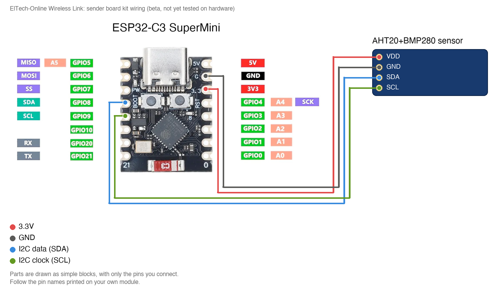
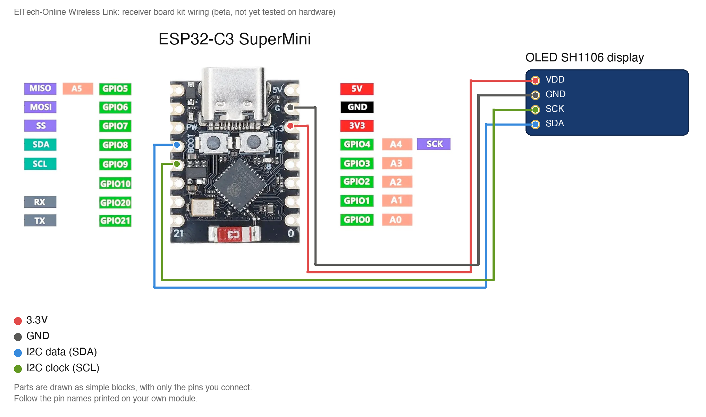

# ElTech-Online ESP32-C3 Wireless Link

[](https://buymeacoffee.com/eltech)

> **Status: BETA, not tested.** The code compiles for the ESP32-C3, but this kit has not been built and tested on real hardware yet. Pin choices, default values and the wiring may still change. Use it to read and learn from; expect to do some fault-finding if you build it now.

A beginner-friendly **learning kit**: build a wireless sensor link from **two ESP32-C3 SuperMini boards**: one reads an **AHT20+BMP280** temperature, humidity and pressure sensor and transmits the readings; the other receives them and shows them on a **1.3" OLED SH1106** display, with no router, no internet and no pairing. No prior electronics or coding experience needed, and no soldering: everything plugs into a breadboard.

Designed, coded and documented by ElTech-Online in Callander, Scotland — the kit design, firmware and this guide are our own work.


## What you'll learn

The technique is getting two boards to talk to each other:

- **ESP-NOW** — Espressif's direct board-to-board radio link, using the WiFi radio without a WiFi network
- **Packets and structs** — deciding the exact shape of the data that travels through the air
- **Broadcast** — sending to everyone in range, so no addresses need setting up
- **Measuring a radio link** — signal strength (RSSI) and counting missed packets

Along the way you'll also pick up:

- **Callbacks** — a function the radio calls by itself when a packet arrives
- **Two programs that must agree** — the sender and receiver share a packet layout, a channel and an ID
- **I2C** sensors and displays

The code is written to be read: every section is commented in plain language, and [How the code works](#how-the-code-works) walks through it.

## How ESP-NOW works

Normal WiFi needs an access point: a device joins a network, gets an address, and everything goes through the router. That is a lot of machinery, and joining takes a second or two.

**ESP-NOW** skips all of it. One board transmits a small packet (up to 250 bytes) straight from its radio; any ESP32 listening on the same WiFi channel receives it a few milliseconds later. There is no network name, no password and no connecting. It is how many battery sensors and remote controls work, because the sender can wake up, send and go back to sleep in well under a second.

This kit sends to the **broadcast address**, which every board in range hears, so you never have to look up or type in an address. Two things keep it tidy:

- **`LINK_ID`** — a number in both sketches. The receiver ignores packets with a different one, so two of these kits in the same house don't mix.
- **A packet counter** — the sender numbers its packets. A broadcast is never acknowledged, so the sender can't know whether it was heard. The receiver spots a gap in the numbers and counts it as missed.

The data travels as a **struct**: 24 bytes laid out exactly the same way in both sketches.

## What it does

- **Sender**: reads the sensor and transmits a packet every 2 seconds
- **Receiver**: shows temperature, humidity and pressure, how old the data is, the signal strength in dBm, and packets received and missed
- Shows **LINK LOST** when nothing has arrived for 10 seconds, and recovers by itself
- Both boards print everything to Serial (115200 baud)

It also runs a self-test at power-on and prints it to Serial (115200 baud):

Sender:

```
--- Self-test ---
AHT20:         OK
BMP280:        OK
ESP-NOW radio: OK
RESULT:        PASS
```

Receiver:

```
--- Self-test ---
OLED (SH1106): OK
ESP-NOW radio: OK
RESULT:        PASS
```

There are **two sketches** in this repo:

| Sketch | What it is |
|---|---|
| `sender/` | For the board with the sensor. |
| `receiver/` | For the board with the display. |

## Hardware

| Component | Notes |
|---|---|
| 2 × ESP32-C3 SuperMini |  |
| AHT20+BMP280 sensor module | 4 pins: `VDD`, `SDA`, `GND`, `SCL`. Goes on the sender |
| 1.3" OLED, SH1106 driver, 128×64, I2C | Address `0x3C` (try `0x3D` if blank). Goes on the receiver |
| 2 × breadboard + jumper wires | 4 wires on each board |
| A second USB power source | Not in the kit: a phone charger or power bank, so the sender can go to another room |

## Wiring

### Sender board

| Wire | ESP32-C3 pin | Connects to |
|---|---|---|
| 3.3V | 3V3 | AHT20+BMP280 sensor `VDD` |
| GND | GND | AHT20+BMP280 sensor `GND` |
| I2C data (SDA) | GPIO 8 | AHT20+BMP280 sensor `SDA` |
| I2C clock (SCL) | GPIO 9 | AHT20+BMP280 sensor `SCL` |



### Receiver board

| Wire | ESP32-C3 pin | Connects to |
|---|---|---|
| 3.3V | 3V3 | OLED SH1106 display `VDD` |
| GND | GND | OLED SH1106 display `GND` |
| I2C data (SDA) | GPIO 8 | OLED SH1106 display `SDA` |
| I2C clock (SCL) | GPIO 9 | OLED SH1106 display `SCK` |



The parts are drawn as simple blocks showing only the pins you connect. **Always follow the labels printed on your own modules** — the pin order differs between manufacturers.

Good to know:

- **Both boards are wired the same way**: 3V3, GND, GPIO 8 (SDA) and GPIO 9 (SCL) to the one module.
- **GPIO 8 and 9** are the ESP32-C3 SuperMini's labelled I2C pins.

## Setup (Arduino IDE)

**Before you start:** download and install the free **Arduino IDE 2** from [arduino.cc/en/software](https://www.arduino.cc/en/software). The ESP32-C3 connects over its own USB-C port, so there's no separate USB driver to install. Use a USB cable that carries data: some cheap cables only charge, and then the board never shows up.

1. **Add the ESP32 board index**: `File > Preferences` → Additional Boards Manager URLs:
   ```
   https://raw.githubusercontent.com/espressif/arduino-esp32/gh-pages/package_esp32_index.json
   ```
2. **Install the board package**: `Tools > Board > Boards Manager`, search "esp32", install **esp32 by Espressif Systems**.
3. **Select the board**: `Tools > Board > esp32 > ESP32C3 Dev Module`.
4. **Tools menu settings**:

   | Setting | Value |
   |---|---|
   | Board | ESP32C3 Dev Module |
   | USB CDC On Boot | Enabled |
   | CPU Frequency | 160MHz |
   | Erase All Flash Before Sketch Upload | Disabled |
   | Flash Size | 4MB (32Mb) |
   | Partition Scheme | Default 4MB with spiffs (1.2MB APP/1.5MB SPIFFS) |
   | Upload Speed | 921600 |

5. **Install libraries** via `Sketch > Include Library > Manage Libraries`:
   - Adafruit AHTX0
   - Adafruit BMP280 Library
   - Adafruit SH110X
   - Adafruit GFX Library

   If Library Manager asks to install dependencies (Adafruit BusIO, Adafruit Unified Sensor), click **Install all**.

   **Compiled with** these versions (compile-tested only; hardware confirmation pending):

   | Package | Version |
   |---|---|
   | esp32 by Espressif Systems (board package) | 3.3.11 |
   | Adafruit AHTX0 | 2.0.6 |
   | Adafruit BMP280 Library | 3.0.0 |
   | Adafruit SH110X | 2.1.15 |
   | Adafruit GFX Library | 1.12.6 |
   | Adafruit BusIO | 1.17.4 |
   | Adafruit Unified Sensor | 1.1.15 |

6. Upload `sender/sender.ino` to the board with the sensor and `receiver/receiver.ino` to the board with the display. Plug in one board at a time so you can't mix up the ports.

### Opening the Serial Monitor

1. Open it with `Tools > Serial Monitor`.
2. Set the speed drop-down to **115200 baud**. At the wrong speed, you'll see garbled characters or nothing at all.
3. The self-test only runs once, right after the board starts. If you opened the Serial Monitor too late, press the board's **RST** (reset) button to run it again.

**Seeing nothing at all?** Check that `Tools > USB CDC On Boot` is set to **Enabled**.

### If the upload fails

If the upload stops with an error like `Failed to connect`, put the board into download mode by hand:

1. Hold down the **BOOT** button on the board.
2. While holding it, press and release **RST** (or unplug and re-plug the USB cable).
3. Release **BOOT**, choose the port under `Tools > Port` and click **Upload** again.
4. When the upload finishes, press **RST** once to start the new code.

## Trying the link

1. Power both boards. Within a couple of seconds the receiver shows the sender's readings.
2. Watch the signal strength: around **-40 dBm** side by side. The number is always negative, and closer to 0 is stronger.
3. Carry the sender (on a power bank) to another room. The signal drops towards -70 or -80 dBm and the *Missed* count starts to climb.
4. Find the point where **LINK LOST** appears, then walk back.

The ESP32-C3 SuperMini has a very small antenna, and the sketch runs it at reduced power because that gives a cleaner signal on this board. Expect a few rooms indoors, not the hundreds of metres ESP-NOW can manage with a proper antenna.

## How the code works

Open `sender/sender.ino` and `receiver/receiver.ino` side by side. Each starts with a short guide to its own layout. Every Arduino sketch has two main functions: `setup()` runs once when the board starts, and `loop()` then runs over and over, forever.

1. **Settings at the top of both sketches.** `LINK_ID` and `WIFI_CHANNEL` must match.
2. **The packet.** `struct Packet` is identical in both files. Add a value to one and you must add it to the other, in the same place.
3. **Starting the radio.** `startRadio()` turns the radio on without joining a network, sets the channel and starts ESP-NOW.
4. **Sending.** In the sender's `loop()`: fill in a packet, `esp_now_send()` it to the broadcast address, wait 2 seconds.
5. **Receiving.** `onPacket()` is a callback: the radio calls it the moment a packet arrives. It checks the size and the ID, counts any gap in the numbers, and copies the data.
6. **Showing it.** The receiver's `loop()` only draws the screen from the latest packet.

## Try this next

Small changes to try yourself, roughly easiest first. Change one thing, upload, and check the result before moving on.

1. **Send more often.** Change `SEND_EVERY_MS` in the sender.
2. **Add a value to the packet**, for example the sender's own chip temperature (`temperatureRead()`), and show it on the receiver.
3. **Blink the LED on the sender** each time it transmits (GPIO 8 is in use here, so add an LED and resistor on another pin).
4. **Send a reply.** Have the receiver answer each packet, so the sender knows it was heard.
5. **Save power.** Put the sender into deep sleep between packets with `esp_deep_sleep()`, and work out how long a battery would last.
6. **Add a second sender** with its own number in the packet, and show both on the receiver.

## Beta notes

This repository is published early. Still to be confirmed on real hardware:

- Real indoor range at the reduced 8.5 dBm transmit power
- The receive callback against the ESP32 board package version listed below (its form changed between versions 2 and 3)

Found a problem? Please open an issue on this repository.

## License

The code, documentation and wiring diagram are MIT-licensed — see [LICENSE](LICENSE). Use them, modify them, build your own kit with them.

**The ElTech-Online name and logo are not covered by the MIT license.** The logo files (`logo.png` and any `logo_bitmap.h`) are © ElTech-Online, all rights reserved. If you build or sell your own version, swap in your own logo and don't present it as an ElTech-Online product.
